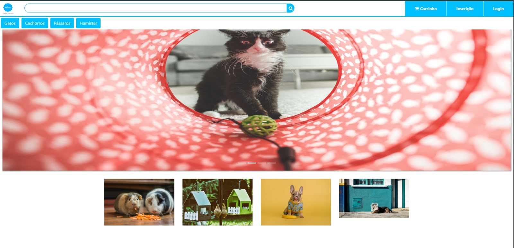
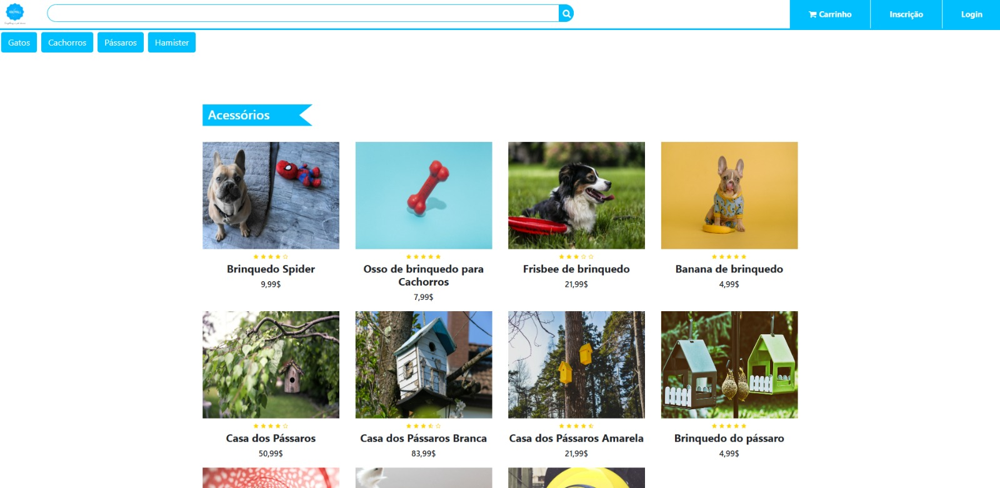

# PetShop E-commerce - Frontend Interface

A modern, responsive e-commerce web interface designed for pet supplies, featuring a clean layout and intuitive navigation.

## 🖥️ Interface Preview

  
   
  

## 🚀 Project Overview
This repository showcases the technical evolution of an e-commerce platform. The **finalized, production-ready version** including all responsive UI components and the grid system is located within the `/petshop` directory.

## 🛠️ Tech Stack
- **Frontend:** HTML5, CSS3
- **Framework:** Bootstrap 5
- **Design Patterns:** Responsive Web Design, Flexbox/Grid
- **Tools:** Git & GitHub

## 👨‍💻 My Technical Contributions
As a **Frontend Developer** in this collaborative project, I was responsible for:
- **UI Architecture:** Building the main responsive layout using **Bootstrap 5** to ensure compatibility across devices.
- **Component Styling:** Customizing CSS for the product cards, including star ratings and interactive elements.
- **Navigation System:** Implementing a clean header with search functionality and accessible category filtering.
- **Visual Consistency:** Managing the integration of high-quality assets and maintaining professional spacing/typography.

## 🏁 Getting Started
This repository contains various development stages and modules. To view the final functional site:

1. **Clone the repository:**
   `git clone https://github.com/Lucascla18/faculdade-PetShop.git`
2. **Navigate to the production folder:**
   `cd petshop`
3. **Open the project:**
   Launch the `index.html` file found inside the `/petshop` folder in your browser.
